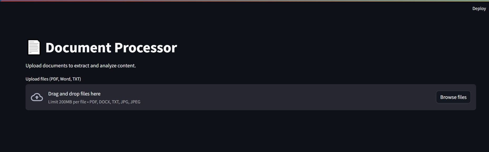
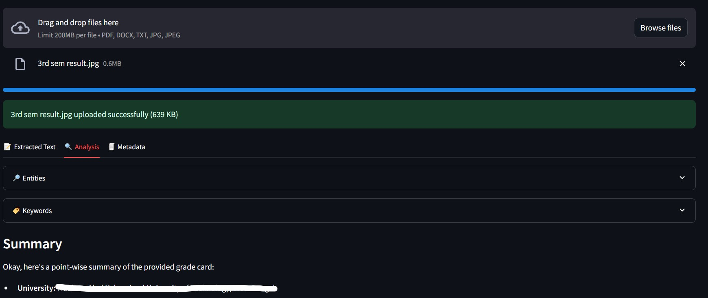
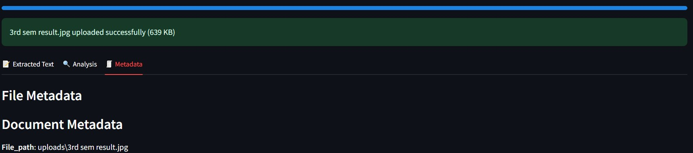

# 📄 Document Processor(NLP)


A powerful document processing application that extracts text from various file formats (PDF, DOCX, images) and performs advanced analysis including entity recognition, keyword extraction, and summarization.

## ✨ Features

- **Multi-format Support**: Process PDFs (both digital and scanned), Word documents, and images
- **Advanced OCR**: Integrated Tesseract OCR for extracting text from scanned documents
- **NLP Analysis**: Entity recognition, keyword extraction, and summarization
- **Metadata Extraction**: Get detailed document metadata including author, creation date, and more
- **User-friendly Interface**: Beautiful Streamlit web interface with interactive elements
  
## Main Interface
<p></p>

## Analysis View
<p></p>

## Metadata View
<p></p>

## 🚀 Getting Started

### Prerequisites

- opencv-python
- pytesseract
- PyMuPDF
- python-docx
- streamlit
- SQLAlchemy
- spacy
- https://github.com/explosion/spacy-models/releases/download/en_core_web_sm-3.7.1/en_core_web_sm-3.7.1-py3-none-any.whl


### Installation

1. Clone the repository:
```bash
git clone https://github.com/yourusername/document-processor.git
cd document-processor
